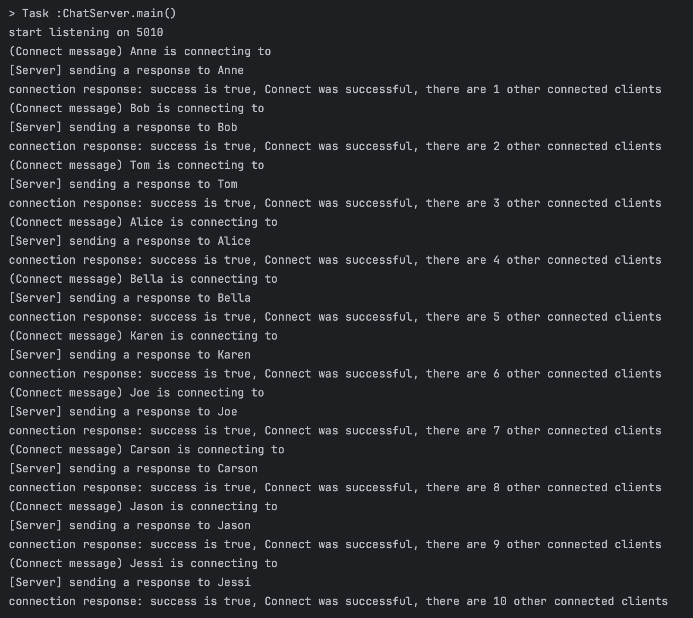
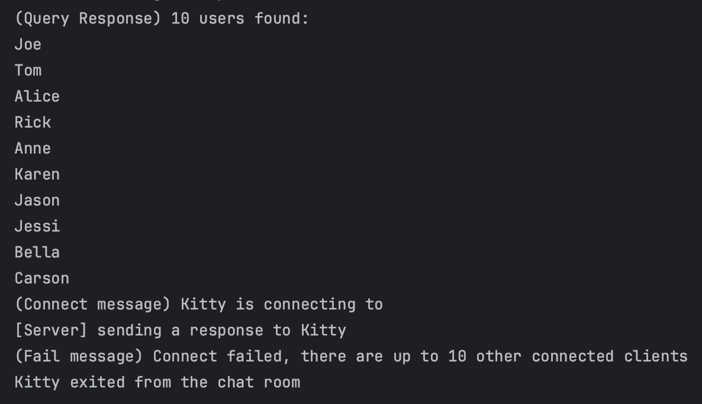
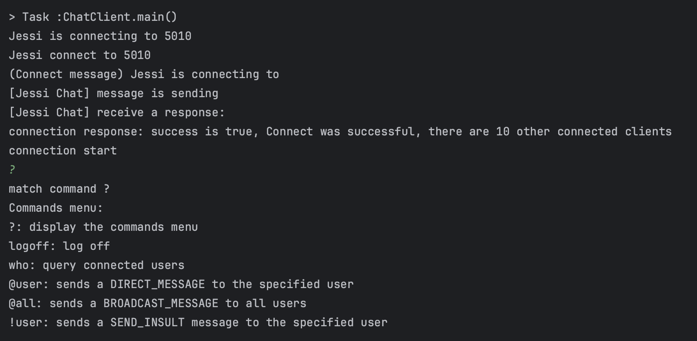
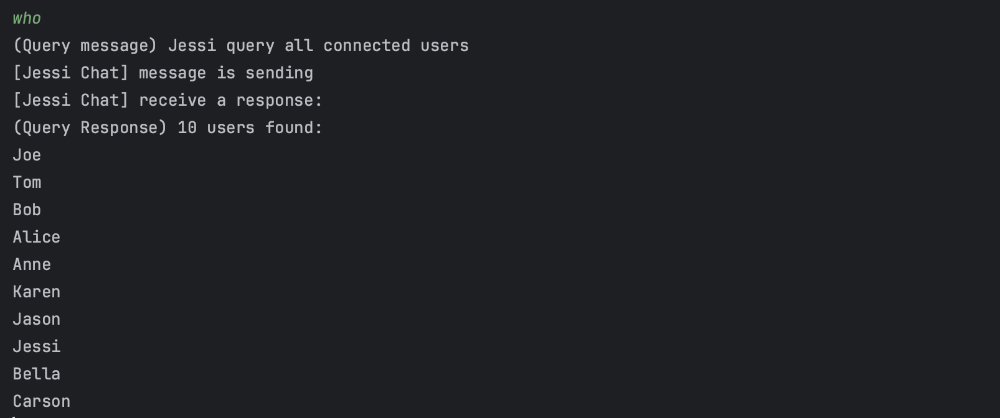
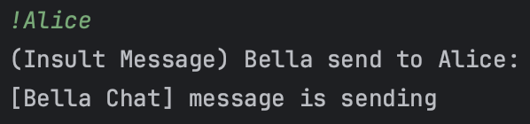
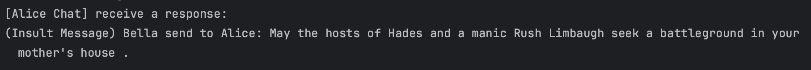
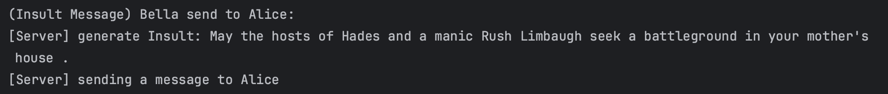

# SocketSpeak  👨‍💼💻💬

     <br>

Socket Speak is a chat room consisting of a server and multiple clients. The server is responsible for the client connections, accepting messages from one client, and sending the messages to all attached clients. Clients can open a socket to communicate with the server and the user may either send a message that is public
in the chat room, or that goes directly to a single, specified client. This program also includes the feature to generate and send a randomly generated sentence.   

### Get Start

- invoke `main` in `ChatServer`
```
[port]
5010
```
- invoke `main` in `ChatClient`
```
[port] [username]
5010 Anne
5010 Bob
5010 Tom
or 
[port] [username] [IP]
5010 Anne 127.0.0.1
```
##### tips:
- `IP` must be same with server IP address. It will be 'localhost' if not given.
- you can launch up to 10 ChatClient.

##### file structure:
```
  - src
    - main
      - java
        - Client
           - ChatClient (main method) 
        - Server
           - ChatSrever (main method)
  - insult_grammar.json
```
##### tip:
- `implementation files('lib/RandomInsult.jar')` make sure it is added to Gradle Dependencies.
- when run or build, make sure working directory is on /Assignment6, and json file is on working directory, so json file can be accessed.

### Message Rules
To send message the user must use additional commands. You may type "?" to check the commands menu or please reference to the list below.
- ?: display the commands menu
- who: query connected users
- @user: sends a DIRECT_MESSAGE to the specified user
- @all: sends a BROADCAST_MESSAGE to all users
- !user: sends a SEND_INSULT message to the specified user
  With the above commands, ****no messages**** are sent unless the @user, @all, !user commands are used.

### Sample Screenshot Run the Program
#### Client Connect
- The server side when client connect to the port
  
- Up to 10 clients can be connected and in a chat room at one time
  

#### Display Command Menu
- Screenshot when display the command menu
  

#### Query Response
- The client may check who is connected
  

#### Random Sentence Generator
- The client sender side message when sending an insult message directly to another client
  
- The client receiver side message getting an insult message directly from another client
  
- Screenshot of server side when client sending an insult message directly to another client
  